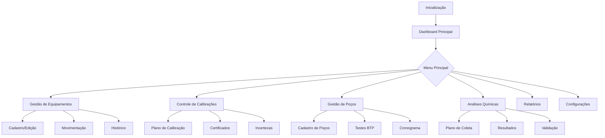

# PRD DEFINITIVO - Sistema de Gestão Metrológica (SGM)
## Sistema de Gerenciamento de Equipamentos de Medição - Petróleo & Gás Natural

---

## 📋 1. SUMÁRIO EXECUTIVO

### 1.1 Visão Geral
O **Sistema de Gestão Metrológica (SGM)** é uma aplicação desktop especializada para controle e gestão completa de equipamentos de medição fiscal e operacional na indústria de petróleo e gás natural. O sistema substituirá o controle atual em planilhas Excel por uma solução integrada, automatizada e em total conformidade com as normas ISO/IEC 17025:2017, ISO 10012:2004 e o Regulamento Técnico de Medição ANP/Inmetro nº 1/2013.

### 1.2 Objetivos Principais
- ✅ **Eliminar dependência de planilhas Excel** e seus riscos inerentes
- ✅ **Garantir conformidade regulamentar total** com ISO 17025, ISO 10012 e ANP/Inmetro
- ✅ **Automatizar processos críticos** de calibração e controle metrológico
- ✅ **Centralizar gestão** de ~370 equipamentos ativos em 7 polos de produção
- ✅ **Prover rastreabilidade completa** para auditorias e fiscalizações
- ✅ **Gerenciar ciclo de vida completo** dos equipamentos de medição

### 1.3 Características Técnicas Definitivas
- **Tipo:** Aplicação Desktop Local Mono-usuário
- **Banco de Dados:** SQLite (arquivo .db na pasta do aplicativo)
- **Stack:** Electron + React + Node.js + TypeScript
- **Conformidade:** ISO/IEC 17025:2017, ISO 10012:2004, ANP/Inmetro nº 1/2013
- **Instalação:** Autocontida, sem dependências externas

### 1.4 Escopo Confirmado
**DENTRO DO ESCOPO:**
- Gestão completa de equipamentos e certificados
- Controle de calibrações e incertezas
- Gestão de poços (BTP) e análises químicas (FQ)
- Controle de placas de orifício e trechos retos
- Sistema de alertas e notificações
- Relatórios regulamentares e dashboards
- MOC (Management of Change)
- Gestão de não conformidades
- App mobile para consultas básicas

**FORA DO ESCOPO:**
- Inteligência Artificial / Machine Learning
- IoT / Telemetria em tempo real
- Gêmeos Digitais
- Integração com sensores remotos
- Multi-usuário ou acesso simultâneo

---

## 🏗️ 2. ARQUITETURA DO SISTEMA

### 2.1 Arquitetura Técnica Final

```
┌─────────────────────────────────────────┐
│         CAMADA DE APRESENTAÇÃO          │
│      Electron + React + Material-UI      │
├─────────────────────────────────────────┤
│          CAMADA DE NEGÓCIO              │
│    Node.js + TypeScript + Validações    │
├─────────────────────────────────────────┤
│         CAMADA DE DADOS                 │
│    SQLite (arquivo local) + Triggers    │
└─────────────────────────────────────────┘
```

### 2.2 Estrutura de Diretórios

```
sgm/
├── src/
│   ├── main/                 # Processo principal Electron
│   │   ├── database/         # Conexão SQLite e models
│   │   ├── services/         # Lógica de negócio
│   │   │   ├── equipment/    # Serviços de equipamentos
│   │   │   ├── calibration/  # Serviços de calibração
│   │   │   ├── uncertainty/  # Cálculos de incerteza
│   │   │   ├── wells/        # Gestão de poços
│   │   │   └── chemistry/    # Análises químicas
│   │   └── ipc/             # Handlers IPC
│   ├── renderer/            # Interface React
│   │   ├── components/      # Componentes UI
│   │   ├── pages/          # Páginas/Módulos
│   │   ├── hooks/          # Custom hooks
│   │   └── utils/          # Utilitários
│   └── shared/             # Código compartilhado
│       ├── types/          # TypeScript types
│       ├── constants/      # Constantes
│       └── validations/    # Regras de validação
├── database/
│   ├── sgm.db             # Arquivo SQLite principal
│   ├── migrations/        # Versionamento do schema
│   ├── seeds/            # Dados iniciais
│   └── backups/          # Backups automáticos
├── documents/            # Certificados e anexos
└── resources/           # Assets e templates
```

### 2.3 Localização do Banco de Dados

```javascript
// Caminho do banco de dados
const dbPath = {
  production: path.join(app.getPath('userData'), 'database', 'sgm.db'),
  backup: path.join(app.getPath('userData'), 'database', 'backups'),
  documents: path.join(app.getPath('userData'), 'documents')
}
// Exemplo: C:\Users\[Usuario]\AppData\Roaming\SGM\database\sgm.db
```

---

## 💾 3. MODELO DE DADOS COMPLETO

### 3.1 Schema do Banco de Dados - Tabelas Core

#### 3.1.1 Hierarquia Organizacional

```sql
-- Tabela: polos (7 registros)
CREATE TABLE polos (
    polo_id INTEGER PRIMARY KEY AUTOINCREMENT,
    nome_polo TEXT NOT NULL,
    sigla_polo TEXT UNIQUE NOT NULL,
    diretoria TEXT,
    empresa TEXT,
    cnpj TEXT,
    responsavel_tecnico TEXT,
    telefone TEXT,
    email TEXT,
    status TEXT DEFAULT 'ativo',
    created_at DATETIME DEFAULT CURRENT_TIMESTAMP,
    updated_at DATETIME DEFAULT CURRENT_TIMESTAMP
);

-- Tabela: instalacoes
CREATE TABLE instalacoes (
    instalacao_id INTEGER PRIMARY KEY AUTOINCREMENT,
    polo_id INTEGER NOT NULL,
    nome_instalacao TEXT NOT NULL,
    sigla_instalacao TEXT UNIQUE NOT NULL,
    tipo_instalacao TEXT,
    situacao TEXT,
    ambiente TEXT CHECK(ambiente IN ('Offshore', 'Onshore')),
    lamina_agua REAL,
    estado TEXT,
    cidade TEXT,
    operadora TEXT,
    campo TEXT,
    capacidade_petroleo REAL,
    capacidade_gas REAL,
    latitude REAL,
    longitude REAL,
    responsavel_metrologia TEXT,
    status TEXT DEFAULT 'ativo',
    created_at DATETIME DEFAULT CURRENT_TIMESTAMP,
    updated_at DATETIME DEFAULT CURRENT_TIMESTAMP,
    FOREIGN KEY (polo_id) REFERENCES polos(polo_id)
);
```

#### 3.1.2 Gestão de Equipamentos

```sql
-- Tabela: equipamentos (expandida com novos campos)
CREATE TABLE equipamentos (
    equipamento_id INTEGER PRIMARY KEY AUTOINCREMENT,
    numero_serie TEXT UNIQUE NOT NULL,
    tag_equipamento TEXT UNIQUE NOT NULL,
    nome_equipamento TEXT NOT NULL,
    tipo_equipamento TEXT NOT NULL, -- primario, secundario, auxiliar
    subtipo_equipamento TEXT, -- coriolis, turbina, ultrasonico, etc
    modelo TEXT,
    fabricante TEXT,
    
    -- Dados técnicos
    unidade_medida TEXT,
    resolucao REAL,
    exatidao TEXT,
    
    -- Faixas de operação
    faixa_min_equipamento REAL,
    faixa_max_equipamento REAL,
    faixa_min_pam REAL,
    faixa_max_pam REAL,
    faixa_min_calibrada REAL,
    faixa_max_calibrada REAL,
    
    -- Localização
    instalacao_id INTEGER NOT NULL,
    polo_id INTEGER NOT NULL,
    localizacao_fisica TEXT,
    
    -- Classificação e critérios
    classificacao TEXT CHECK(classificacao IN ('Fiscal', 'Apropriação', 'Operacional', 'Transferência Custódia')),
    frequencia_calibracao_anp INTEGER,
    criterio_aceitacao TEXT,
    erro_maximo_admissivel REAL,
    
    -- Fatores específicos
    fator_k REAL, -- Para medidores de vazão
    diametro_nominal REAL, -- DN para medidores
    numero_fios INTEGER, -- Para PT-100 (2, 3 ou 4 fios)
    
    -- Software e versões
    software_versao TEXT,
    firmware_versao TEXT,
    
    -- Integração e controle
    ativo_mxm BOOLEAN DEFAULT FALSE,
    numero_ativo_mxm TEXT,
    plano_manutencao_mxm TEXT,
    condicoes_ambientais TEXT,
    
    -- Status
    status_equipamento TEXT DEFAULT 'ativo',
    em_calibracao BOOLEAN DEFAULT FALSE,
    data_instalacao DATE,
    data_desativacao DATE,
    motivo_desativacao TEXT,
    
    created_at DATETIME DEFAULT CURRENT_TIMESTAMP,
    updated_at DATETIME DEFAULT CURRENT_TIMESTAMP,
    
    FOREIGN KEY (instalacao_id) REFERENCES instalacoes(instalacao_id),
    FOREIGN KEY (polo_id) REFERENCES polos(polo_id)
);

-- Tabela: pontos_medicao
CREATE TABLE pontos_medicao (
    ponto_medicao_id INTEGER PRIMARY KEY AUTOINCREMENT,
    equipamento_id INTEGER NOT NULL,
    tag_ponto_medicao TEXT UNIQUE NOT NULL,
    nome_ponto_medicao TEXT NOT NULL,
    
    -- Classificações
    classificacao_aplicacao TEXT CHECK(classificacao_aplicacao IN 
        ('Fiscal', 'Apropriação', 'Transferência Custódia', 'Operacional')),
    classificacao_natureza TEXT CHECK(classificacao_natureza IN 
        ('Óleo', 'Gás Natural', 'Condensado', 'Água')),
    
    -- Localização e tipo
    localizacao TEXT,
    tipo_medidor_primario TEXT,
    sistema_medicao TEXT, -- Identificador do sistema
    
    -- Status e controle
    status_ponto TEXT DEFAULT 'ativo',
    ponto_critico BOOLEAN DEFAULT FALSE,
    observacoes TEXT,
    
    created_at DATETIME DEFAULT CURRENT_TIMESTAMP,
    updated_at DATETIME DEFAULT CURRENT_TIMESTAMP,
    
    FOREIGN KEY (equipamento_id) REFERENCES equipamentos(equipamento_id)
);
```

#### 3.1.3 Controle de Calibrações e Certificados

```sql
-- Tabela: plano_calibracao
CREATE TABLE plano_calibracao (
    calibracao_id INTEGER PRIMARY KEY AUTOINCREMENT,
    equipamento_id INTEGER NOT NULL,
    
    -- Datas de controle
    data_ultima_calibracao DATE,
    data_proxima_calibracao DATE,
    data_prevista_retirada DATE,
    data_prevista_retorno DATE,
    
    -- Status calculados
    dias_para_vencer INTEGER GENERATED ALWAYS AS 
        (julianday(data_proxima_calibracao) - julianday('now')) STORED,
    status_calibracao TEXT GENERATED ALWAYS AS (
        CASE 
            WHEN dias_para_vencer < 0 THEN 'vencido'
            WHEN dias_para_vencer <= 7 THEN 'critico'
            WHEN dias_para_vencer <= 30 THEN 'alerta'
            WHEN dias_para_vencer <= 90 THEN 'proximo'
            ELSE 'ok'
        END
    ) STORED,
    
    -- Certificados
    certificado_numero TEXT,
    certificado_revisao TEXT,
    certificado_path TEXT,
    certificado_status TEXT,
    
    -- Laboratório e responsável
    laboratorio TEXT,
    laboratorio_acreditacao TEXT,
    responsavel_tecnico TEXT,
    
    -- Controle
    solicitacao_calibracao TEXT,
    ordem_servico TEXT,
    observacoes TEXT,
    
    created_at DATETIME DEFAULT CURRENT_TIMESTAMP,
    updated_at DATETIME DEFAULT CURRENT_TIMESTAMP,
    
    FOREIGN KEY (equipamento_id) REFERENCES equipamentos(equipamento_id)
);

-- Tabela: historico_calibracoes (expandida)
CREATE TABLE historico_calibracoes (
    historico_id INTEGER PRIMARY KEY AUTOINCREMENT,
    equipamento_id INTEGER NOT NULL,
    
    -- Dados da calibração
    data_calibracao DATE NOT NULL,
    data_validade DATE,
    tipo_calibracao TEXT, -- Completa, Parcial, Verificação
    
    -- Certificado
    certificado_numero TEXT,
    certificado_revisao TEXT,
    certificado_path TEXT,
    
    -- Laboratório
    laboratorio TEXT,
    laboratorio_acreditacao TEXT,
    
    -- Resultados
    resultado TEXT CHECK(resultado IN ('Aprovado', 'Reprovado', 'Aprovado com Restrições')),
    
    -- Incertezas e erros
    incerteza_expandida REAL,
    incerteza_tipo TEXT,
    erro_maximo_encontrado REAL,
    
    -- Fator K histórico (para medidores de vazão)
    fator_k_anterior REAL,
    fator_k_novo REAL,
    
    -- Dados ambientais
    temperatura_calibracao REAL,
    umidade_calibracao REAL,
    pressao_calibracao REAL,
    
    -- Rastreabilidade
    padroes_utilizados TEXT,
    rastreabilidade_padroes TEXT,
    
    -- Responsáveis
    executado_por TEXT,
    aprovado_por TEXT,
    
    observacoes TEXT,
    created_at DATETIME DEFAULT CURRENT_TIMESTAMP,
    
    FOREIGN KEY (equipamento_id) REFERENCES equipamentos(equipamento_id)
);
```

#### 3.1.4 Validações e Controles Metrológicos

```sql
-- Tabela: rm_equip (critérios de validação)
CREATE TABLE rm_equip (
    rm_id INTEGER PRIMARY KEY AUTOINCREMENT,
    codigo_rm TEXT UNIQUE NOT NULL,
    descricao_criterio TEXT NOT NULL,
    tipo_equipamento TEXT,
    subtipo_equipamento TEXT,
    
    -- Limites e critérios
    limite_minimo REAL,
    limite_maximo REAL,
    unidade TEXT,
    formula_calculo TEXT,
    
    -- Referências normativas
    norma_referencia TEXT,
    clausula_norma TEXT,
    
    -- Aplicabilidade
    classificacao_aplicavel TEXT, -- Fiscal, Apropriação, etc
    obrigatorio BOOLEAN DEFAULT TRUE,
    
    ativo BOOLEAN DEFAULT TRUE,
    created_at DATETIME DEFAULT CURRENT_TIMESTAMP
);

-- Tabela: controle_incertezas
CREATE TABLE controle_incertezas (
    incerteza_id INTEGER PRIMARY KEY AUTOINCREMENT,
    equipamento_id INTEGER NOT NULL,
    ponto_medicao_id INTEGER,
    
    -- Identificação
    numero_relatorio TEXT,
    data_medicao DATE NOT NULL,
    numero_certificado TEXT,
    
    -- Valores de incerteza
    vazao_volumetrica REAL,
    incerteza_expandida REAL,
    incerteza_expandida_relativa REAL,
    fator_abrangencia REAL DEFAULT 2, -- k=2 para 95%
    
    -- Critérios e limites
    criterio_aceitacao_percentual REAL,
    limite_regulamentar REAL,
    
    -- Classificação
    tipo_incerteza TEXT,
    metodo_calculo TEXT, -- GUM, Monte Carlo, etc
    
    -- Status
    status TEXT GENERATED ALWAYS AS (
        CASE 
            WHEN incerteza_expandida_relativa <= criterio_aceitacao_percentual THEN 'aprovado'
            ELSE 'reprovado'
        END
    ) STORED,
    
    -- Detalhamento
    componentes_incerteza TEXT, -- JSON com breakdown
    observacoes TEXT,
    
    created_at DATETIME DEFAULT CURRENT_TIMESTAMP,
    updated_at DATETIME DEFAULT CURRENT_TIMESTAMP,
    
    FOREIGN KEY (equipamento_id) REFERENCES equipamentos(equipamento_id),
    FOREIGN KEY (ponto_medicao_id) REFERENCES pontos_medicao(ponto_medicao_id)
);

-- Tabela: incerteza_limite
CREATE TABLE incerteza_limite (
    limite_id INTEGER PRIMARY KEY AUTOINCREMENT,
    fluido TEXT NOT NULL,
    classificacao TEXT NOT NULL,
    aplicacao TEXT,
    
    -- Limites
    limite_percentual REAL NOT NULL,
    limite_absoluto REAL,
    
    -- Referências
    norma_referencia TEXT,
    artigo_clausula TEXT,
    
    observacoes TEXT,
    ativo BOOLEAN DEFAULT TRUE,
    
    UNIQUE(fluido, classificacao, aplicacao)
);
```

#### 3.1.5 Equipamentos Especializados

```sql
-- Tabela: placas_orificio
CREATE TABLE placas_orificio (
    placa_id INTEGER PRIMARY KEY AUTOINCREMENT,
    equipamento_id INTEGER NOT NULL,
    
    -- Identificação
    numero_serie_stand_by TEXT, -- Placa reserva
    carta_numero TEXT,
    
    -- Dimensões críticas @ 20°C
    diametro_externo_20c REAL, -- De
    diametro_orificio_20c REAL, -- dr
    espessura REAL, -- E
    diametro_nominal REAL, -- DN
    diametro_medio REAL, -- Dm
    diametro_real REAL, -- Dr
    
    -- Características
    material TEXT,
    classe_pressao TEXT, -- ASA
    norma_fabricacao TEXT,
    beta_ratio REAL GENERATED ALWAYS AS 
        (diametro_orificio_20c / diametro_interno_tubo) STORED,
    
    -- Controle de uso
    data_fabricacao DATE,
    data_inspecao DATE,
    data_instalacao DATE,
    data_maxima_uso DATE,
    data_prevista_calibracao DATE,
    
    -- Certificação
    certificado_dimensional TEXT,
    certificado_material TEXT,
    
    -- Critérios
    criterio_aceitacao TEXT,
    erro_maximo_admissivel REAL,
    
    observacoes TEXT,
    created_at DATETIME DEFAULT CURRENT_TIMESTAMP,
    updated_at DATETIME DEFAULT CURRENT_TIMESTAMP,
    
    FOREIGN KEY (equipamento_id) REFERENCES equipamentos(equipamento_id)
);

-- Tabela: trechos_retos
CREATE TABLE trechos_retos (
    trecho_id INTEGER PRIMARY KEY AUTOINCREMENT,
    equipamento_id INTEGER NOT NULL,
    
    -- Identificação
    carta_numero TEXT,
    localizacao_sistema TEXT, -- Montante ou Jusante
    
    -- Dimensões @ 20°C
    diametro_nominal REAL, -- DN
    diametro_medio REAL, -- DM
    diametro_real REAL, -- DR
    comprimento REAL,
    
    -- Características
    material_confeccao TEXT,
    classe_pressao TEXT,
    schedule TEXT,
    
    -- Componentes
    quantidade_tubos INTEGER,
    tem_junta BOOLEAN DEFAULT FALSE,
    tem_valvula BOOLEAN DEFAULT FALSE,
    tem_retificador BOOLEAN DEFAULT FALSE,
    numero_poco TEXT,
    
    -- Normas e inspeção
    normas_tecnicas TEXT,
    data_inspecao DATE,
    data_instalacao DATE,
    data_maxima_uso DATE,
    data_prevista_calibracao DATE,
    
    -- Certificação
    certificado_dimensional TEXT,
    
    observacoes TEXT,
    created_at DATETIME DEFAULT CURRENT_TIMESTAMP,
    updated_at DATETIME DEFAULT CURRENT_TIMESTAMP,
    
    FOREIGN KEY (equipamento_id) REFERENCES equipamentos(equipamento_id)
);

-- Tabela: valvulas
CREATE TABLE valvulas (
    valvula_id INTEGER PRIMARY KEY AUTOINCREMENT,
    equipamento_id INTEGER NOT NULL,
    
    -- Identificação
    tag_valvula TEXT UNIQUE NOT NULL,
    tipo_valvula TEXT,
    funcao_valvula TEXT, -- Bloqueio, Controle, Alívio, etc
    
    -- Características técnicas
    diametro_nominal REAL,
    classe_pressao TEXT,
    pressao_trabalho REAL,
    pressao_maxima REAL,
    
    -- Construção
    material_corpo TEXT,
    material_internos TEXT,
    tipo_acionamento TEXT, -- Manual, Pneumático, Elétrico, Hidráulico
    tipo_sede TEXT,
    tipo_vedacao TEXT,
    
    -- Teste de estanqueidade
    teste_estanqueidade_periodicidade INTEGER, -- dias
    data_ultimo_teste DATE,
    data_proximo_teste DATE,
    resultado_ultimo_teste TEXT,
    taxa_vazamento REAL,
    
    -- Status
    status_valvula TEXT DEFAULT 'operacional',
    posicao_normal TEXT, -- NA, NF, Variável
    
    observacoes TEXT,
    created_at DATETIME DEFAULT CURRENT_TIMESTAMP,
    updated_at DATETIME DEFAULT CURRENT_TIMESTAMP,
    
    FOREIGN KEY (equipamento_id) REFERENCES equipamentos(equipamento_id)
);
```

#### 3.1.6 Controle de Poços e Análises

```sql
-- Tabela: cadastro_poco
CREATE TABLE cadastro_poco (
    poco_id INTEGER PRIMARY KEY AUTOINCREMENT,
    codigo_poco TEXT UNIQUE NOT NULL,
    polo_id INTEGER NOT NULL,
    instalacao_id INTEGER NOT NULL,
    
    -- Identificação
    nome_poco TEXT NOT NULL,
    tipo_poco TEXT, -- Produtor, Injetor, etc
    codigo_anp TEXT UNIQUE,
    
    -- Características
    profundidade REAL,
    diametro TEXT,
    completacao TEXT,
    
    -- Frequências de teste
    frequencia_teste_dias INTEGER DEFAULT 90,
    frequencia_analise_dias INTEGER,
    
    -- Status
    status_poco TEXT DEFAULT 'ativo',
    data_ativacao DATE,
    data_desativacao DATE,
    
    observacoes TEXT,
    created_at DATETIME DEFAULT CURRENT_TIMESTAMP,
    updated_at DATETIME DEFAULT CURRENT_TIMESTAMP,
    
    FOREIGN KEY (polo_id) REFERENCES polos(polo_id),
    FOREIGN KEY (instalacao_id) REFERENCES instalacoes(instalacao_id)
);

-- Tabela: teste_poco (BTP expandida)
CREATE TABLE teste_poco (
    teste_id INTEGER PRIMARY KEY AUTOINCREMENT,
    poco_id INTEGER NOT NULL,
    
    -- Identificação do teste
    data_teste DATE NOT NULL,
    numero_btp TEXT UNIQUE,
    tipo_teste TEXT DEFAULT 'BTP',
    tag_medidor_oleo TEXT,
    
    -- Resultados do teste
    vazao_oleo REAL, -- m³/d
    vazao_gas REAL, -- mil m³/d
    vazao_agua REAL, -- m³/d
    bsw REAL CHECK(bsw >= 0 AND bsw <= 100), -- %
    rgo REAL, -- Razão Gás-Óleo
    pressao_cabeca REAL, -- kgf/cm²
    temperatura_teste REAL, -- °C
    
    -- Documentação
    arquivo_btp_path TEXT,
    rt_numero TEXT,
    data_rt DATE,
    bra_numero TEXT,
    
    -- Controle
    data_desembarque DATE,
    data_recebimento_btp DATE,
    data_envio_resultado DATE,
    
    -- Validação
    validado BOOLEAN DEFAULT FALSE,
    validado_por TEXT,
    data_validacao DATE,
    
    -- Atualização
    atualizacao_potencial BOOLEAN DEFAULT FALSE,
    data_atualizacao_potencial DATE,
    
    -- Responsáveis
    responsavel_teste TEXT,
    aprovado_por TEXT,
    
    status_teste TEXT DEFAULT 'realizado',
    observacoes TEXT,
    created_at DATETIME DEFAULT CURRENT_TIMESTAMP,
    
    FOREIGN KEY (poco_id) REFERENCES cadastro_poco(poco_id)
);

-- Tabela: analises_quimicas (FQ expandida)
CREATE TABLE analises_quimicas (
    analise_id INTEGER PRIMARY KEY AUTOINCREMENT,
    ponto_medicao_id INTEGER,
    poco_id INTEGER,
    
    -- Identificação
    data_coleta DATE NOT NULL,
    tipo_analise TEXT,
    natureza_fluido TEXT,
    tag_ponto_medicao TEXT,
    
    -- Coleta
    sot_numero TEXT, -- Solicitação de Trabalho
    cilindro_numero TEXT,
    metodo_coleta TEXT,
    responsavel_coleta TEXT,
    
    -- Laboratório
    laboratorio TEXT,
    data_envio_lab DATE,
    data_recebimento_lab DATE,
    
    -- Resultados
    rt_numero TEXT,
    data_rt DATE,
    data_resultado DATE,
    
    -- Parâmetros analisados (JSON)
    parametros_analisados TEXT, -- JSON com todos os parâmetros
    
    -- Principais resultados
    densidade_20c REAL,
    bsw_karl_fischer REAL,
    salinidade REAL,
    poder_calorifico_superior REAL,
    poder_calorifico_inferior REAL,
    
    -- Documentação
    arquivo_resultado_path TEXT,
    bra_numero TEXT,
    
    -- Validação
    validado BOOLEAN DEFAULT FALSE,
    validado_por TEXT,
    data_validacao DATE,
    
    -- Atualização CV
    atualizacao_cv BOOLEAN DEFAULT FALSE,
    data_atualizacao_cv DATE,
    
    status_analise TEXT DEFAULT 'em_andamento',
    observacoes TEXT,
    created_at DATETIME DEFAULT CURRENT_TIMESTAMP,
    
    FOREIGN KEY (ponto_medicao_id) REFERENCES pontos_medicao(ponto_medicao_id),
    FOREIGN KEY (poco_id) REFERENCES cadastro_poco(poco_id)
);

-- Tabela: plano_coleta
CREATE TABLE plano_coleta (
    coleta_id INTEGER PRIMARY KEY AUTOINCREMENT,
    ponto_medicao_id INTEGER,
    tipo_coleta TEXT, -- FQ, Especial, etc
    
    -- Planejamento
    data_programada DATE,
    periodicidade_dias INTEGER,
    
    -- Logística
    data_embarque DATE,
    data_desembarque DATE,
    
    -- Validações
    validado_operacao BOOLEAN DEFAULT FALSE,
    validado_laboratorio BOOLEAN DEFAULT FALSE,
    
    -- Recursos
    cilindros_disponiveis BOOLEAN DEFAULT FALSE,
    quantidade_cilindros INTEGER,
    
    -- Execução
    embarque_agendado BOOLEAN DEFAULT FALSE,
    embarque_realizado BOOLEAN DEFAULT FALSE,
    coleta_realizada BOOLEAN DEFAULT FALSE,
    resultado_emitido BOOLEAN DEFAULT FALSE,
    
    data_real_embarque DATE,
    data_real_coleta DATE,
    
    responsavel TEXT,
    observacoes TEXT,
    status TEXT DEFAULT 'planejado',
    
    created_at DATETIME DEFAULT CURRENT_TIMESTAMP,
    updated_at DATETIME DEFAULT CURRENT_TIMESTAMP,
    
    FOREIGN KEY (ponto_medicao_id) REFERENCES pontos_medicao(ponto_medicao_id)
);

-- Tabela: regra_analises_fq
CREATE TABLE regra_analises_fq (
    regra_id INTEGER PRIMARY KEY AUTOINCREMENT,
    fluido TEXT NOT NULL,
    tipo_analise TEXT NOT NULL,
    
    -- Periodicidade
    periodicidade_dias INTEGER NOT NULL,
    periodicidade_tipo TEXT, -- Fixa, Variável
    
    -- Identificação
    sigla TEXT,
    codigo_analise TEXT,
    
    -- Regulamentação
    regulamento TEXT,
    artigo_clausula TEXT,
    
    -- Parâmetros obrigatórios
    parametros_obrigatorios TEXT, -- JSON com lista
    
    -- Aplicabilidade
    aplicavel_fiscal BOOLEAN DEFAULT TRUE,
    aplicavel_apropriacao BOOLEAN DEFAULT TRUE,
    aplicavel_operacional BOOLEAN DEFAULT FALSE,
    
    observacoes TEXT,
    ativo BOOLEAN DEFAULT TRUE,
    
    UNIQUE(fluido, tipo_analise)
);
```

#### 3.1.7 Gestão de Movimentação e Logística

```sql
-- Tabela: movimentacao_equipamentos
CREATE TABLE movimentacao_equipamentos (
    movimentacao_id INTEGER PRIMARY KEY AUTOINCREMENT,
    equipamento_id INTEGER NOT NULL,
    
    -- Tipo de movimentação
    tipo_movimentacao TEXT CHECK(tipo_movimentacao IN 
        ('Retirada', 'Instalação', 'Transferência', 'Envio Lab', 'Retorno Lab')),
    
    -- Origem e destino
    local_origem TEXT,
    local_destino TEXT,
    instalacao_origem_id INTEGER,
    instalacao_destino_id INTEGER,
    
    -- Datas
    data_movimentacao DATE NOT NULL,
    data_prevista_retorno DATE,
    data_efetiva_retorno DATE,
    
    -- Documentação
    numero_remessa TEXT,
    numero_nota_fiscal TEXT,
    transportadora TEXT,
    
    -- Motivo
    motivo TEXT,
    ordem_servico TEXT,
    solicitante TEXT,
    
    -- Responsáveis
    retirado_por TEXT,
    autorizado_por TEXT,
    recebido_por TEXT,
    
    -- Status
    status_movimentacao TEXT DEFAULT 'em_transito',
    equipamento_substituto_id INTEGER,
    
    observacoes TEXT,
    created_at DATETIME DEFAULT CURRENT_TIMESTAMP,
    
    FOREIGN KEY (equipamento_id) REFERENCES equipamentos(equipamento_id),
    FOREIGN KEY (instalacao_origem_id) REFERENCES instalacoes(instalacao_id),
    FOREIGN KEY (instalacao_destino_id) REFERENCES instalacoes(instalacao_id),
    FOREIGN KEY (equipamento_substituto_id) REFERENCES equipamentos(equipamento_id)
);

-- Tabela: estoque_sobressalentes
CREATE TABLE estoque_sobressalentes (
    estoque_id INTEGER PRIMARY KEY AUTOINCREMENT,
    equipamento_id INTEGER NOT NULL,
    
    -- Localização
    local_armazenamento TEXT,
    posicao_estoque TEXT,
    instalacao_id INTEGER,
    
    -- Status
    disponivel BOOLEAN DEFAULT TRUE,
    condicao TEXT CHECK(condicao IN ('Novo', 'Usado', 'Recondicionado')),
    
    -- Controle
    data_entrada DATE,
    origem TEXT,
    proxima_calibracao DATE,
    
    observacoes TEXT,
    created_at DATETIME DEFAULT CURRENT_TIMESTAMP,
    
    FOREIGN KEY (equipamento_id) REFERENCES equipamentos(equipamento_id),
    FOREIGN KEY (instalacao_id) REFERENCES instalacoes(instalacao_id)
);
```

#### 3.1.8 Gestão de Não Conformidades e MOC

```sql
-- Tabela: nao_conformidades
CREATE TABLE nao_conformidades (
    nc_id INTEGER PRIMARY KEY AUTOINCREMENT,
    
    -- Identificação
    numero_nc TEXT UNIQUE NOT NULL,
    data_abertura DATE NOT NULL,
    tipo_nc TEXT CHECK(tipo_nc IN ('Maior', 'Menor', 'Observação')),
    origem TEXT CHECK(origem IN ('Auditoria', 'Inspeção', 'Operação', 'Cliente')),
    
    -- Relacionamentos
    equipamento_id INTEGER,
    ponto_medicao_id INTEGER,
    instalacao_id INTEGER,
    
    -- Descrição
    titulo TEXT NOT NULL,
    descricao_nc TEXT NOT NULL,
    requisito_violado TEXT,
    norma_referencia TEXT,
    
    -- Análise de causa raiz
    metodo_analise TEXT, -- 5 Porquês, Ishikawa, etc
    causa_raiz TEXT,
    analise_detalhada TEXT,
    
    -- Impacto
    impacto_operacional TEXT,
    impacto_medicao TEXT,
    severidade TEXT CHECK(severidade IN ('Baixa', 'Média', 'Alta', 'Crítica')),
    
    -- Responsáveis
    identificado_por TEXT,
    responsavel_analise TEXT,
    responsavel_solucao TEXT,
    
    -- Prazos
    prazo_resposta DATE,
    prazo_solucao DATE,
    data_fechamento DATE,
    
    -- Status
    status_nc TEXT DEFAULT 'aberta',
    
    observacoes TEXT,
    created_at DATETIME DEFAULT CURRENT_TIMESTAMP,
    updated_at DATETIME DEFAULT CURRENT_TIMESTAMP,
    
    FOREIGN KEY (equipamento_id) REFERENCES equipamentos(equipamento_id),
    FOREIGN KEY (ponto_medicao_id) REFERENCES pontos_medicao(ponto_medicao_id),
    FOREIGN KEY (instalacao_id) REFERENCES instalacoes(instalacao_id)
);

-- Tabela: acoes_corretivas
CREATE TABLE acoes_corretivas (
    acao_id INTEGER PRIMARY KEY AUTOINCREMENT,
    nc_id INTEGER NOT NULL,
    
    -- Identificação
    numero_acao TEXT,
    tipo_acao TEXT CHECK(tipo_acao IN ('Correção', 'Corretiva', 'Preventiva')),
    
    -- Descrição
    descricao_acao TEXT NOT NULL,
    resultado_esperado TEXT,
    
    -- Responsável e prazo
    responsavel TEXT,
    prazo_execucao DATE,
    
    -- Execução
    data_inicio DATE,
    data_conclusao DATE,
    status_acao TEXT DEFAULT 'planejada',
    
    -- Verificação
    eficaz BOOLEAN,
    verificado_por TEXT,
    data_verificacao DATE,
    evidencias TEXT,
    
    observacoes TEXT,
    created_at DATETIME DEFAULT CURRENT_TIMESTAMP,
    
    FOREIGN KEY (nc_id) REFERENCES nao_conformidades(nc_id)
);

-- Tabela: moc_controle_mudancas
CREATE TABLE moc_controle_mudancas (
    moc_id INTEGER PRIMARY KEY AUTOINCREMENT,
    
    -- Identificação
    numero_moc TEXT UNIQUE NOT NULL,
    data_solicitacao DATE NOT NULL,
    tipo_mudanca TEXT CHECK(tipo_mudanca IN ('Temporária', 'Permanente')),
    categoria TEXT CHECK(categoria IN ('Equipamento', 'Procedimento', 'Software', 'Instalação')),
    
    -- Relacionamentos
    equipamento_id INTEGER,
    instalacao_id INTEGER,
    
    -- Descrição
    titulo TEXT NOT NULL,
    descricao_mudanca TEXT NOT NULL,
    justificativa TEXT NOT NULL,
    
    -- Análise de impacto
    impacto_metrologia TEXT,
    impacto_seguranca TEXT,
    impacto_operacional TEXT,
    impacto_regulatorio TEXT,
    analise_risco TEXT,
    
    -- Aprovações
    solicitante TEXT,
    aprovador_tecnico TEXT,
    data_aprovacao_tecnica DATE,
    aprovador_gerencial TEXT,
    data_aprovacao_gerencial DATE,
    
    -- Implementação
    responsavel_implementacao TEXT,
    data_inicio_implementacao DATE,
    data_conclusao_implementacao DATE,
    
    -- Validação
    validacao_necessaria BOOLEAN DEFAULT TRUE,
    responsavel_validacao TEXT,
    data_validacao DATE,
    resultado_validacao TEXT,
    
    -- Documentação
    documentos_alterados TEXT, -- JSON com lista
    procedimentos_atualizados TEXT, -- JSON com lista
    treinamento_necessario BOOLEAN DEFAULT FALSE,
    
    -- Status
    status_moc TEXT DEFAULT 'solicitada',
    
    observacoes TEXT,
    created_at DATETIME DEFAULT CURRENT_TIMESTAMP,
    updated_at DATETIME DEFAULT CURRENT_TIMESTAMP,
    
    FOREIGN KEY (equipamento_id) REFERENCES equipamentos(equipamento_id),
    FOREIGN KEY (instalacao_id) REFERENCES instalacoes(instalacao_id)
);
```

#### 3.1.9 Tabelas de Configuração e Listas

```sql
-- Tabela: configuracoes_sistema
CREATE TABLE configuracoes_sistema (
    config_id INTEGER PRIMARY KEY AUTOINCREMENT,
    categoria TEXT NOT NULL,
    chave TEXT NOT NULL,
    valor TEXT,
    tipo_valor TEXT, -- string, number, boolean, json
    descricao TEXT,
    modificavel_usuario BOOLEAN DEFAULT TRUE,
    
    UNIQUE(categoria, chave)
);

-- Tabela: listas_selecao
CREATE TABLE listas_selecao (
    lista_id INTEGER PRIMARY KEY AUTOINCREMENT,
    tipo_lista TEXT NOT NULL,
    valor TEXT NOT NULL,
    descricao TEXT,
    ordem INTEGER,
    ativo BOOLEAN DEFAULT TRUE,
    
    UNIQUE(tipo_lista, valor)
);

-- Valores iniciais para listas_selecao
INSERT INTO listas_selecao (tipo_lista, valor) VALUES
    ('fabricante', 'Emerson'),
    ('fabricante', 'Yokogawa'),
    ('fabricante', 'ABB'),
    ('fabricante', 'Endress+Hauser'),
    ('tipo_equipamento', 'Medidor Primário'),
    ('tipo_equipamento', 'Transmissor'),
    ('tipo_equipamento', 'Sensor'),
    ('tipo_equipamento', 'Computador de Vazão'),
    ('classificacao', 'Fiscal'),
    ('classificacao', 'Apropriação'),
    ('classificacao', 'Operacional'),
    ('fluido', 'Óleo'),
    ('fluido', 'Gás Natural'),
    ('fluido', 'Condensado'),
    ('fluido', 'Água');
```

### 3.2 Triggers e Validações Automáticas

```sql
-- Trigger: Atualizar timestamp
CREATE TRIGGER update_timestamp_equipamentos
AFTER UPDATE ON equipamentos
BEGIN
    UPDATE equipamentos 
    SET updated_at = CURRENT_TIMESTAMP 
    WHERE equipamento_id = NEW.equipamento_id;
END;

-- Trigger: Calcular próxima calibração
CREATE TRIGGER calcular_proxima_calibracao
AFTER UPDATE OF data_ultima_calibracao ON plano_calibracao
BEGIN
    UPDATE plano_calibracao 
    SET data_proxima_calibracao = date(NEW.data_ultima_calibracao, 
        '+' || (SELECT frequencia_calibracao_anp FROM equipamentos 
                WHERE equipamento_id = NEW.equipamento_id) || ' days')
    WHERE calibracao_id = NEW.calibracao_id;
END;

-- Trigger: Validar incerteza contra limites
CREATE TRIGGER validar_incerteza_limite
BEFORE INSERT ON controle_incertezas
BEGIN
    SELECT CASE
        WHEN NEW.incerteza_expandida_relativa > (
            SELECT limite_percentual 
            FROM incerteza_limite 
            WHERE fluido = (SELECT unidade_medida FROM equipamentos 
                          WHERE equipamento_id = NEW.equipamento_id)
            AND classificacao = (SELECT classificacao FROM equipamentos 
                               WHERE equipamento_id = NEW.equipamento_id)
        )
        THEN RAISE(ABORT, 'Incerteza excede limite regulamentar')
    END;
END;

-- Trigger: Atualizar status de poço após teste
CREATE TRIGGER atualizar_poco_apos_teste
AFTER INSERT ON teste_poco
BEGIN
    UPDATE cadastro_poco
    SET updated_at = CURRENT_TIMESTAMP
    WHERE poco_id = NEW.poco_id;
END;

-- Trigger: Log de movimentação ao alterar localização
CREATE TRIGGER log_movimentacao_equipamento
AFTER UPDATE OF instalacao_id ON equipamentos
WHEN OLD.instalacao_id != NEW.instalacao_id
BEGIN
    INSERT INTO movimentacao_equipamentos (
        equipamento_id,
        tipo_movimentacao,
        instalacao_origem_id,
        instalacao_destino_id,
        data_movimentacao,
        motivo,
        status_movimentacao
    ) VALUES (
        NEW.equipamento_id,
        'Transferência',
        OLD.instalacao_id,
        NEW.instalacao_id,
        CURRENT_TIMESTAMP,
        'Transferência automática registrada',
        'concluída'
    );
END;

-- Trigger: Validar Fator K em medidores
CREATE TRIGGER validar_fator_k
BEFORE UPDATE OF fator_k ON equipamentos
WHEN NEW.subtipo_equipamento IN ('coriolis', 'turbina', 'ultrasonico')
BEGIN
    SELECT CASE
        WHEN NEW.fator_k IS NULL OR NEW.fator_k <= 0
        THEN RAISE(ABORT, 'Fator K inválido para medidor de vazão')
    END;
END;
```

---

## 🔄 4. FLUXOGRAMAS DE PROCESSOS

### 4.1 Fluxo Principal do Sistema



### 4.2 Fluxo de Calibração Completo

```
1. MONITORAMENTO DIÁRIO
   └─> Sistema verifica vencimentos
   
2. ALERTAS AUTOMÁTICOS
   ├─> 90 dias antes: Planejamento
   ├─> 30 dias antes: Preparação
   ├─> 7 dias antes: Urgente
   └─> Vencido: Crítico

3. RETIRADA DO EQUIPAMENTO
   ├─> Registro de movimentação
   ├─> Instalação de sobressalente
   └─> Atualização de status

4. ENVIO PARA CALIBRAÇÃO
   ├─> Seleção de laboratório
   ├─> Geração de OS
   └─> Controle de prazo

5. RETORNO E VALIDAÇÃO
   ├─> Recebimento do equipamento
   ├─> Análise do certificado
   ├─> Validação de incertezas
   └─> Aprovação/Reprovação

6. REINSTALAÇÃO
   ├─> Registro de instalação
   ├─> Atualização de dados
   └─> Liberação para operação
```

### 4.3 Fluxo de Gestão de Mudanças (MOC)

```
1. SOLICITAÇÃO
   ├─> Identificação da necessidade
   ├─> Preenchimento do MOC
   └─> Justificativa técnica

2. ANÁLISE DE IMPACTO
   ├─> Impacto metrológico
   ├─> Impacto regulatório
   ├─> Impacto operacional
   └─> Análise de risco

3. APROVAÇÕES
   ├─> Aprovação técnica
   ├─> Aprovação gerencial
   └─> Aprovação regulatória

4. IMPLEMENTAÇÃO
   ├─> Planejamento
   ├─> Execução
   ├─> Documentação
   └─> Treinamento

5. VALIDAÇÃO
   ├─> Testes de aceitação
   ├─> Verificação de conformidade
   └─> Fechamento do MOC
```

---

## 📊 5. FUNCIONALIDADES DETALHADAS

### 5.1 Dashboard Principal

#### 5.1.1 Widgets e KPIs
```typescript
interface DashboardMetrics {
  // Conformidade
  compliance: {
    fiscal: number;          // % equipamentos fiscais conformes
    apropriacao: number;     // % equipamentos apropriação conformes
    operacional: number;     // % equipamentos operacionais conformes
    global: number;          // % conformidade geral
  };
  
  // Alertas por criticidade
  alerts: {
    vencidos: Equipment[];   // Lista de equipamentos vencidos
    criticos: Equipment[];   // Vencimento < 7 dias
    alertas: Equipment[];    // Vencimento < 30 dias
    proximos: Equipment[];   // Vencimento < 90 dias
  };
  
  // Calibrações
  calibrations: {
    realizadas_mes: number;
    programadas_mes: number;
    atrasadas: number;
    em_andamento: number;
  };
  
  // Poços
  wells: {
    testes_realizados: number;
    testes_pendentes: number;
    proximos_30_dias: number;
  };
  
  // Análises Químicas
  chemistry: {
    coletas_programadas: number;
    analises_em_lab: number;
    resultados_pendentes: number;
  };
  
  // Performance
  performance: {
    disponibilidade: number;  // % equipamentos disponíveis
    mtbf: number;            // Mean Time Between Failures
    tempo_medio_calibracao: number; // dias
  };
}
```

#### 5.1.2 Sistema de Cores e Alertas
```javascript
const AlertColors = {
  ok: '#4CAF50',        // Verde - Conforme
  proximo: '#2196F3',   // Azul - Atenção futura
  alerta: '#FF9800',    // Laranja - Atenção
  critico: '#F44336',   // Vermelho - Crítico
  vencido: '#9E9E9E'    // Cinza - Vencido
};

const AlertRules = {
  fiscal: {
    critico: 7,   // dias
    alerta: 15,   // dias
    proximo: 30   // dias
  },
  apropriacao: {
    critico: 15,
    alerta: 30,
    proximo: 60
  },
  operacional: {
    critico: 30,
    alerta: 60,
    proximo: 90
  }
};
```

### 5.2 Gestão de Equipamentos

#### 5.2.1 Cadastro Inteligente
- **Auto-preenchimento**: Baseado em modelo e fabricante
- **Validação em tempo real**: Número de série único
- **Cálculo automático**: Frequências baseadas em classificação
- **Vinculação inteligente**: Sugestão de ponto de medição

#### 5.2.2 Gestão de Fator K
```typescript
interface FatorKManagement {
  // Para medidores de vazão
  medidor_id: number;
  tipo_medidor: 'coriolis' | 'turbina' | 'ultrasonico';
  
  // Valores de Fator K
  fator_k_nominal: number;
  fator_k_atual: number;
  
  // Histórico
  historico: Array<{
    data: Date;
    fator_k_anterior: number;
    fator_k_novo: number;
    certificado: string;
    motivo_alteracao: string;
  }>;
  
  // Validação
  desvio_maximo_permitido: number; // %
  alerta_desvio: boolean;
}
```

#### 5.2.3 Controle de Movimentação
- **Rastreamento completo**: Origem → Transporte → Destino
- **Substituição automática**: Gestão de sobressalentes
- **Histórico de localização**: Timeline de movimentações
- **Integração com calibração**: Link com envio para laboratório

### 5.3 Controle de Calibrações

#### 5.3.1 Planejamento Otimizado
```typescript
interface CalibrationPlanning {
  // Otimização por rota
  groupByLocation: boolean;
  
  // Otimização por tipo
  groupByType: boolean;
  
  // Otimização por laboratório
  groupByLab: boolean;
  
  // Considerações
  considerMinimumBatch: number; // Mínimo de equipamentos
  considerShutdownWindows: boolean; // Paradas programadas
  considerResourceAvailability: boolean; // Disponibilidade de recursos
}
```

#### 5.3.2 Validação de Certificados
- **OCR automático**: Extração de dados do PDF (futuro)
- **Validação de campos**: Completude e consistência
- **Verificação de acreditação**: Laboratório válido
- **Cálculo de incerteza**: Conformidade com limites

### 5.4 Gestão de Poços (BTP)

#### 5.4.1 Controle de Testes
```typescript
interface WellTest {
  // Identificação
  poco_id: number;
  data_teste: Date;
  numero_btp: string;
  
  // Medições obrigatórias
  vazao_oleo: number;      // m³/d
  vazao_gas: number;       // mil m³/d
  vazao_agua: number;      // m³/d
  bsw: number;             // % (0-100)
  rgo: number;             // Razão Gás-Óleo
  
  // Validações
  validacoes: {
    vazoes_positivas: boolean;
    bsw_range: boolean;
    rgo_coerente: boolean;
    arquivo_anexado: boolean;
  };
  
  // Alertas
  proximo_teste: Date;
  dias_para_vencer: number;
  alerta_ativo: boolean;
}
```

#### 5.4.2 Dashboard de Poços
- **Timeline visual**: Testes realizados e programados
- **Gráficos de tendência**: Evolução de produção
- **Alertas preventivos**: 30, 15, 7 dias antes
- **Análise comparativa**: Performance entre poços

### 5.5 Análises Químicas (FQ)

#### 5.5.1 Gestão de Coletas
- **Planejamento anual**: Baseado em periodicidade
- **Controle de cilindros**: Disponibilidade e rastreamento
- **Logística integrada**: Embarque e desembarque
- **Chain of custody**: Rastreabilidade completa

#### 5.5.2 Resultados e Validação
```typescript
interface ChemicalAnalysis {
  // Parâmetros principais
  densidade_20c: number;
  bsw_karl_fischer: number;
  salinidade: number;
  poder_calorifico_superior: number;
  poder_calorifico_inferior: number;
  
  // Composição (%)
  composicao: {
    metano: number;
    etano: number;
    propano: number;
    butano: number;
    pentano_plus: number;
    co2: number;
    n2: number;
    h2s: number;
  };
  
  // Validação
  limites_atendidos: boolean;
  desvio_historico: number;
  aprovado_para_cv: boolean;
}
```

### 5.6 Gestão de Não Conformidades

#### 5.6.1 Registro e Análise
- **Classificação automática**: Maior, Menor, Observação
- **Análise de causa raiz**: 5 Porquês, Ishikawa
- **Impacto assessment**: Operacional, Metrológico, Regulatório
- **Workflow de aprovação**: Múltiplos níveis

#### 5.6.2 Ações Corretivas
- **Planejamento estruturado**: Ações com responsáveis e prazos
- **Acompanhamento**: Status e progresso
- **Verificação de eficácia**: Validação pós-implementação
- **Prevenção de recorrência**: Análise de tendências

### 5.7 MOC - Controle de Mudanças

#### 5.7.1 Workflow de Aprovação
```
SOLICITANTE → TÉCNICO → GERENCIAL → IMPLEMENTAÇÃO → VALIDAÇÃO
     ↓           ↓          ↓            ↓             ↓
  Proposta    Análise   Aprovação   Execução    Verificação
```

#### 5.7.2 Documentação e Rastreabilidade
- **Versionamento**: Controle de revisões de documentos
- **Impacto mapping**: Identificação de áreas afetadas
- **Training matrix**: Necessidades de treinamento
- **Audit trail**: Histórico completo de alterações

---

## 📱 6. MÓDULO MOBILE (Consulta)

### 6.1 Características
- **Read-only**: Apenas consulta, sem edição
- **PWA**: Progressive Web App (não nativo)
- **Offline capable**: Cache local para consultas offline
- **Responsive**: Adaptado para tablets e smartphones

### 6.2 Funcionalidades Mobile
```typescript
interface MobileFeatures {
  // Consultas disponíveis
  consultarEquipamento: (tag: string) => Equipment;
  consultarCertificado: (numero: string) => Certificate;
  verificarVencimentos: () => Alert[];
  visualizarDashboard: () => DashboardMetrics;
  
  // QR Code
  scanQRCode: () => string; // Retorna TAG do equipamento
  
  // Sincronização
  syncOfflineData: () => void;
  lastSyncTime: Date;
}
```

---

## 📈 7. RELATÓRIOS E EXPORTAÇÕES

### 7.1 Relatórios Regulamentares

#### 7.1.1 Relatório ANP Mensal
- **Conteúdo obrigatório**:
  - Lista de equipamentos fiscais
  - Status de calibração
  - Certificados vigentes
  - Incertezas calculadas
  - Não conformidades
  - Ações corretivas

#### 7.1.2 Relatório ISO 17025
- **Evidências de conformidade**:
  - Rastreabilidade metrológica
  - Competência técnica
  - Imparcialidade
  - Confidencialidade
  - Gestão de riscos

### 7.2 Exportações

#### 7.2.1 Formatos Suportados
```typescript
interface ExportFormats {
  excel: {
    extension: '.xlsx';
    templates: ['ANP', 'ISO', 'Gerencial', 'Custom'];
    formatting: boolean; // Cores, bordas, etc
  };
  
  pdf: {
    extension: '.pdf';
    headers: boolean;
    footers: boolean;
    watermark: boolean;
    signature: boolean;
  };
  
  csv: {
    extension: '.csv';
    delimiter: ',' | ';';
    encoding: 'UTF-8' | 'ISO-8859-1';
  };
}
```

---

## 🔐 8. REQUISITOS NÃO FUNCIONAIS

### 8.1 Performance
- **Tempo de resposta**: < 2 segundos para consultas
- **Capacidade**: 10.000+ equipamentos
- **Concorrência**: Mono-usuário (sem concorrência)
- **Backup**: < 5 minutos para backup completo

### 8.2 Segurança
- **Autenticação**: Login local com senha
- **Criptografia**: AES-256 para dados sensíveis
- **Backup**: Criptografado e versionado
- **Logs**: Auditoria completa de operações

### 8.3 Confiabilidade
- **Disponibilidade**: 99,9% (aplicação local)
- **Recuperação**: RTO < 1 hora
- **Integridade**: Validações em múltiplas camadas
- **Consistência**: Transações ACID no SQLite

### 8.4 Usabilidade
- **Curva de aprendizado**: < 1 semana
- **Interface**: Intuitiva e consistente
- **Feedback**: Visual e sonoro para ações
- **Help**: Contextual e integrado

### 8.5 Manutenibilidade
- **Código**: Clean Code principles
- **Documentação**: Inline + externa
- **Testes**: Cobertura > 80%
- **Deploy**: Single executable

---

## 🚀 9. ROADMAP DE IMPLEMENTAÇÃO

### FASE 1: Fundação (Semanas 1-3)
- [x] Setup do projeto Electron + React + TypeScript
- [x] Criação do banco SQLite com schema completo
- [x] Estrutura base de navegação
- [x] Sistema de autenticação local
- [x] Módulo de backup automático

### FASE 2: Core Metrológico (Semanas 4-6)
- [ ] CRUD completo de equipamentos
- [ ] Gestão de Fator K para medidores
- [ ] Sistema de validações RM_EQUIP
- [ ] Controle de calibrações
- [ ] Upload e gestão de certificados
- [ ] Cálculo de incertezas

### FASE 3: Especializações (Semanas 7-9)
- [ ] Gestão de placas de orifício
- [ ] Gestão de trechos retos
- [ ] Controle de válvulas
- [ ] Gestão de poços (BTP)
- [ ] Análises químicas (FQ)
- [ ] Cronogramas visuais

### FASE 4: Controles Avançados (Semanas 10-12)
- [ ] Sistema de alertas multi-nível
- [ ] Controle de movimentação
- [ ] Gestão de sobressalentes
- [ ] Não conformidades
- [ ] MOC (Management of Change)
- [ ] Análise de causa raiz

### FASE 5: Relatórios e Dashboard (Semanas 13-14)
- [ ] Dashboard executivo
- [ ] Relatório ANP automático
- [ ] Relatório ISO 17025
- [ ] Exportações Excel/PDF
- [ ] Gráficos e tendências
- [ ] KPIs operacionais

### FASE 6: Mobile e Finalização (Semanas 15-16)
- [ ] PWA Mobile (consulta)
- [ ] QR Code scanning
- [ ] Otimização de performance
- [ ] Testes de aceitação
- [ ] Documentação completa
- [ ] Treinamento e deploy

---

## 📋 10. CRITÉRIOS DE ACEITAÇÃO

### 10.1 Funcionais
- ✅ Todas as 30+ tabelas implementadas
- ✅ Validações RM_EQUIP funcionando
- ✅ Cálculos de incerteza conforme GUM
- ✅ Sistema de alertas operacional
- ✅ Relatórios ANP/ISO gerados corretamente
- ✅ MOC com workflow completo
- ✅ Gestão de não conformidades
- ✅ Mobile PWA funcional

### 10.2 Não Funcionais
- ✅ Performance < 2s
- ✅ Banco SQLite otimizado
- ✅ Backup automático funcionando
- ✅ Interface responsiva
- ✅ Zero perda de dados

### 10.3 Compliance
- ✅ ISO/IEC 17025:2017 atendida
- ✅ ISO 10012:2004 implementada
- ✅ ANP/Inmetro nº 1/2013 conforme
- ✅ Rastreabilidade completa
- ✅ Auditável

---

## 💡 11. CONSIDERAÇÕES TÉCNICAS FINAIS

### 11.1 Otimizações SQLite
```sql
-- Configurações recomendadas
PRAGMA journal_mode = WAL;        -- Write-Ahead Logging
PRAGMA synchronous = NORMAL;      -- Balanceamento performance/segurança
PRAGMA cache_size = -64000;        -- 64MB cache
PRAGMA temp_store = MEMORY;       -- Temp tables em memória
PRAGMA mmap_size = 268435456;     -- Memory-mapped I/O

-- Índices críticos
CREATE INDEX idx_equip_numero_serie ON equipamentos(numero_serie);
CREATE INDEX idx_equip_tag ON equipamentos(tag_equipamento);
CREATE INDEX idx_calibracao_vencimento ON plano_calibracao(data_proxima_calibracao);
CREATE INDEX idx_poco_teste ON teste_poco(poco_id, data_teste);
```

### 11.2 Estratégia de Backup
```typescript
interface BackupStrategy {
  automatic: {
    frequency: 'daily';
    time: '02:00';
    retention: 30; // dias
  };
  
  incremental: {
    enabled: true;
    frequency: 'hourly';
  };
  
  location: {
    primary: './database/backups/';
    secondary: 'optional_network_path/';
  };
  
  naming: 'sgm_backup_YYYY-MM-DD_HH-mm.db';
  compression: true;
  encryption: true;
}
```

### 11.3 Validações Críticas
```typescript
// Validações que DEVEM ser implementadas
const CriticalValidations = {
  // Equipamentos fiscais
  fiscal: {
    certificado_obrigatorio: true,
    incerteza_maxima: 0.3, // %
    frequencia_calibracao: 365, // dias
    rastreabilidade_completa: true
  },
  
  // Testes de poços
  poco: {
    frequencia_maxima: 90, // dias
    btp_obrigatorio: true,
    validacao_tecnica: true
  },
  
  // Análises químicas
  quimica: {
    chain_of_custody: true,
    laboratorio_acreditado: true,
    parametros_minimos: ['densidade', 'bsw', 'salinidade']
  }
};
```

---

**Documento elaborado por:** Especialista Sênior em Sistemas de Gestão Metrológica  
**Data:** 2025  
**Versão:** 2.0 DEFINITIVA  
**Status:** APROVADO PARA DESENVOLVIMENTO  
**Observação:** Este PRD consolidado incorpora todas as funcionalidades essenciais para gestão completa de sistemas de medição de petróleo e gás natural, em total conformidade com as normas ISO/IEC 17025:2017, ISO 10012:2004 e Regulamento ANP/Inmetro nº 1/2013.